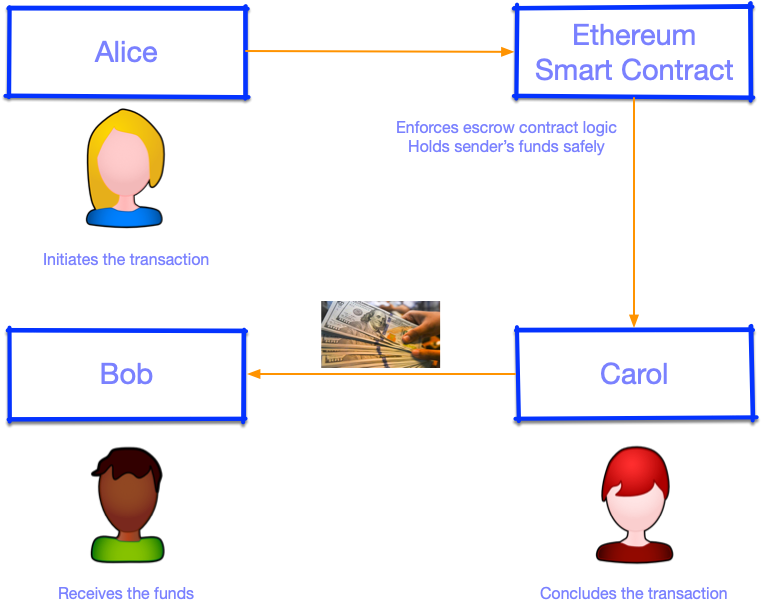

# Remittance

## Problem Statement
You will create a smart contract named Remittance whereby:
* There are three people: Alice, Bob & Carol.
* Alice wants to send funds to Bob, but she only has ether & Bob does not care about Ethereum and
wants to be paid in local currency.
* Luckily, Carol runs an exchange shop that converts ether to local currency.

Therefore, to get the funds to Bob, Alice will allow the funds to be transferred through Carol's
exchange shop. Carol will collect the ether from Alice and give the local currency to Bob.

The steps involved in the operation are as follows:
* Alice creates a Remittance contract with Ether in it and a puzzle.
* Alice sends a one-time-password to Bob; over SMS, say.
* Bob treks to Carol's shop.
* Bob gives Carol his one-time-password.
* Carol submits the password to Alice's remittance contract.
* Only when the password is correct does the contract yield the Ether to Carol.
* Carol gives the local currency to Bob.
* Bob leaves.
* Alice is notified that the transaction went through.

Since they each have only half of the puzzle, Bob & Carol need to meet in person so they can supply
the password to the contract. This is a security measure. *It may help to understand this use-case as
similar to 2-factor authentication.*

**Why is it unnecessary for Alice to send an OTP to Carol?**

## Stretch Goals:
* Did you implement the basic specs airtight, without any exploit, before ploughing through the stretch
goals?
* *Add a deadline*, after which Alice can claim back the unchallenged Ether
* *Add a limit* to how far in the future the deadline can be
* *Add a kill switch* to the whole contract
* Plug a security hole (which one?) by changing one password to the recipient's address
* Make the contract a utility that can be used by David, Emma and anybody with an address
* Make you, the owner of the contract, take a cut of the Ethers. How much? Your call. Perhaps smaller
than what it would cost Alice to deploy the same contract herself
* Did you degrade safety in the name of adding features?
